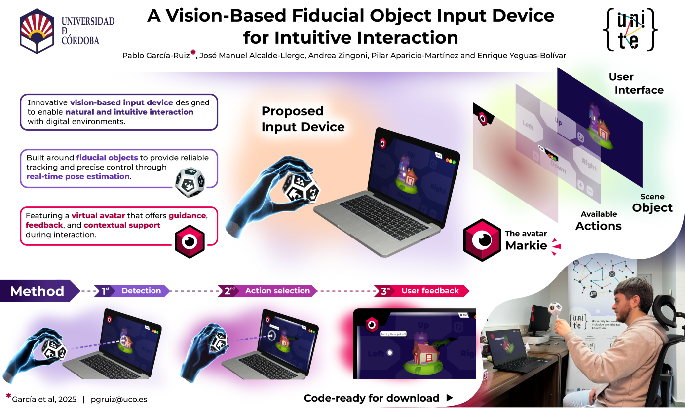

# Fiducial Object Virtual Lab 🧩

**A Vision-Based Fiducial Object Input Device for Intuitive Interaction**



[](https://www.uco.es/investiga/grupos/ava/portfolio/markie-your-fiducial-input-device/)
[](LICENSE)
[](https://opencv.org/)
[](https://godotengine.org/)
[]()
[](https://cmake.org/)
[](https://github.com/pabgaru/Fiducial-Objects)

---

## 📘 Overview

This repository contains the source code and materials for the paper
**“A Vision-Based Fiducial Object Input Device for Intuitive Interaction”**,
which introduces a **vision-based input device** that uses **fiducial objects** for tangible and accessible human-computer interaction.

Our system combines **computer vision** (C++ / OpenCV) with a **3D interactive interface** (Godot 4) to allow users to manipulate virtual content by physically moving fiducial-marked 3D objects. The project was developed under the **UNITE (University Network for Inclusive and digiTal Education)** initiative, aiming to promote **educational inclusion through accessible technologies**.

---

## 🧠 Core Features

* 🎥 **Vision-Based Tracking** — Real-time 6DoF pose estimation of fiducial objects.
* 🧩 **Fiducial Object Library Integration** — Uses custom 3D fiducial objects from [Sensors, 2023].
* 🕹️ **Natural Interaction** — Rotate, scale, and switch between 3D models intuitively.
* 🗣️ **Virtual Assistant (Markie)** — Provides real-time feedback and narration.
* 🌍 **Multilingual Accessibility** — English, Spanish, Italian, and Turkish interfaces.
* 🧮 **Mathematical Rigor** — Implements projection-based cursor tracking via ( p' = K[R|t]p ).
* 🧑‍💻 **Cross-Disciplinary Applications** — Designed for education, rehabilitation, and gaming.

---

## 📂 Project Structure
- **Cpp_fiducial_object/**: C++ implementation for fiducial object tracking.
- **Godot_Markie/**: Godot project files for the interactive interface and avatar (Markie).
- **Resources/**: Contains different assets related to the project.

---


## 🏗️ System Architecture

```
User ─▶ Fiducial Object ─▶ Camera Capture ─▶ Pose Estimation (C++ / OpenCV)
     └────────────────────────────────────▶ Interaction Engine (Godot)
                                            └──▶ Avatar Feedback (Markie)
```

---

## ⚙️ Installation

### Requirements

* C++20 or higher
* [OpenCV 4.x](https://opencv.org/)
* [Godot Engine 4.3+](https://godotengine.org/)
* [Blender](https://www.blender.org/) (for 3D assets management)


### Setup

#### 1. Clone the Repository

First, clone the project and navigate into the directory:

```bash
git clone https://github.com/pabgaru/Markie--A-Fiducial-Input-Device.git
cd Markie--A-Fiducial-Input-Device
```

#### 2. Build the ```inputDevice``` utility

Before proceeding, make sure you have:
- A working OpenCV installation (required).
- Qt is not required for running Markie.

To build the C++ utility (```inputDevice```):

```bash
cd Cpp__fiducial_object
mkdir build && cd build
cmake ..
make
```

This will generate the ```inputDevice``` executable used for a fiducial tracking.


#### 3. Run the Godot Project

You need to have **Godot Engine version 4.3** installed. Then, run the Godot project:

```bash
godot4 --path Godot__Markie
```

Alternatively, you can open ```Godot__Markie``` manually through the Godot editor UI.

---

## 🧩 Usage

1. **Print or create** any fiducial object.
2. **Run** the developer utility ```inputDevice``` to start tracking via webcam.
3. **Open** the Godot editor with the project ```Godot__Markie``` to view the virtual environment.
4. **Run** the main scene inside the Godot project.
5. **Move or rotate** the fiducial object to trigger actions in real time.
6. **Engage with Markie**, the avatar, for voice or text guidance.

---

## 🧪 Evaluation

A user study with **21 participants (ages 21–62)** assessed usability, comfort, and applicability.
All categories scored **>4.0/5.0** on the Likert scale — demonstrating high **intuitiveness, performance**, and **engagement**.

| Category      | Mean Score | Key Aspects                           |
| ------------- | ---------- | ------------------------------------- |
| Usability     | 4.6        | Ease of use, low learning curve       |
| Performance   | 4.5        | Low latency, stable detection         |
| Interaction   | 4.7        | Natural manipulation, smooth feedback |
| Comfort       | 4.4        | Physically accessible                 |
| Applicability | 4.6        | Suitable for education and gaming     |

---

## 🧭 Citation

If you use this work, please cite:

> García-Ruiz, P., Alcalde-Llergo, J. M., Zingoni, A., Aparicio-Martínez, P., & Yeguas-Bolívar, E.
> *A Vision-Based Fiducial Object Input Device for Intuitive Interaction*.
> University of Córdoba & University of Tuscia, 2025.

```bibtex
@inproceedings{10.1007/978-3-031-97763-3_22,
author = {Garc\'{\i}a-Ru\'{\i}z, Pablo and Alcalde-Llergo, Jos\'{e} Manuel and Zingoni, Andrea and Aparicio-Mart\'{\i}nez, Pilar and Yeguas-Bol\'{\i}var, Enrique},
title = {A Vision-Based Fiducial Object Input Device for Intuitive Interaction},
year = {2025},
isbn = {978-3-031-97762-6},
publisher = {Springer-Verlag},
address = {Berlin, Heidelberg},
url = {https://doi.org/10.1007/978-3-031-97763-3_22},
doi = {10.1007/978-3-031-97763-3_22},
booktitle = {Extended Reality: International Conference, XR Salento 2025, Otranto, Italy, June 17–20, 2025, Proceedings, Part I},
pages = {289–297},
numpages = {9},
keywords = {Tangible interaction, User interface, Fiducial object, Fiducial marker, Input device},
location = {Otranto, Italy}
}
```

---

## 🤝 Acknowledgements

This work is part of the **UNITE Project (2023-1-IT02-KA220-HED-0001621181)**,
funded by the **Erasmus+ Programme** of the European Union.
Special thanks to all participants and collaborators from the **University of Córdoba** and **University of Tuscia**.

---

## 📜 License

This project is released under the [MIT License](LICENSE).
